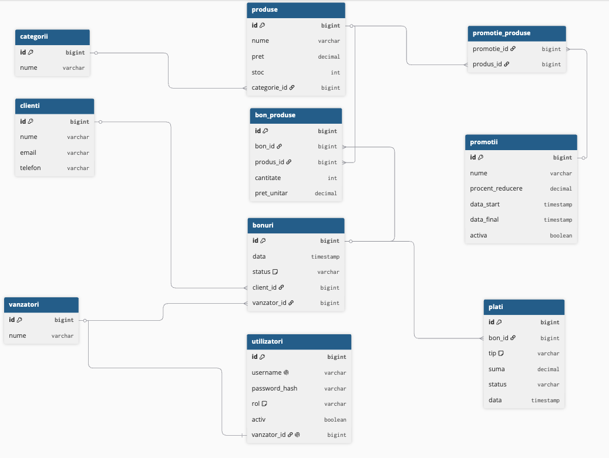

# POS – Casa de Marcat (Spring Boot)

## Descriere generală
Acest proiect reprezintă o aplicație backend de tip **POS (Point of Sale)** – casă de marcat – dezvoltată în **Java cu Spring Boot**, având ca scop gestionarea vânzărilor, produselor, clienților, bonurilor fiscale și plăților.

Aplicația implementează un flux complet de vânzare:
- definirea produselor și a categoriilor
- deschiderea unui bon
- adăugarea produselor pe bon
- efectuarea plății
- actualizarea stocului

---

## Cerințe funcționale

1. Gestionarea categoriilor de produse (creare, listare, actualizare, ștergere)
2. Gestionarea produselor, cu preț, stoc și asociere la o categorie
3. Gestionarea promoțiilor aplicabile unuia sau mai multor produse
4. Gestionarea clienților și a vânzătorilor
5. Autentificare și autorizare pe bază de roluri (USER, ADMIN), cu conturi de utilizator asociate vânzătorilor
6. Emiterea și gestionarea bonurilor fiscale: deschidere, adăugare produse pe bon, modificare/ștergere linii, finalizare
7. Procesarea plăților (CASH/CARD) și urmărirea statusului acestora
8. Validarea datelor introduse și tratarea erorilor cu mesaje specifice pentru fiecare operație
9. Paginare și sortare pentru listele de date (produse, clienți, bonuri)
10. Interfață web cu formulare pentru toate operațiile de tip CRUD
11. Înregistrarea evenimentelor aplicației (logging) pentru operațiuni și erori

---

## Business Requirements
Aplicația respectă următoarele cerințe de business:

1. Un produs aparține unei categorii și are preț și stoc.
2. Un client poate avea mai multe bonuri.
3. Un bon este emis de un singur vânzător.
4. Un bon poate conține mai multe produse (cu cantitate).
5. Un produs poate apărea pe mai multe bonuri.
6. Stocul produselor se reduce la adăugarea pe bon.
7. Un bon poate fi plătit o singură dată.
8. Plata poate fi CASH sau CARD.
9. Un bon are status (OPEN / PAID).
10. Toate operațiile invalide sunt blocate prin validări și excepții.

---

## Flow principal (Vânzare)

1. Se creează categorii și produse
2. Se creează client și vânzător
3. Se creează un bon fiscal (status = OPEN)
4. Se adaugă produse pe bon  
   → stocul se reduce automat
5. Se efectuează plata bonului  
   → bonul devine PAID  
   → se creează o plată
6. Se pot lista detaliile bonului și plățile aferente

---

## Diagrama ER
Diagrama Entitate–Relație descrie structura bazei de date și relațiile dintre entități.



### Tipuri de relații

- **`@OneToOne`**: `Vanzator` ↔ `Utilizator` (fiecare vânzător are cel mult un cont de logare)
- **`@ManyToOne` / `@OneToMany`**: `Categorie` → `Produs`, `Client` → `Bon`, `Vanzator` → `Bon`, `Bon` → `BonProdus`, `Produs` → `BonProdus`, `Bon` → `Plata`
- **`@ManyToMany`**: `Produs` ↔ `Promotie`, prin tabelul asociativ `promotie_produse` (un produs poate fi în mai multe promoții, o promoție poate acoperi mai multe produse)

---

## Entități principale
- **Categorie**
- **Produs**
- **Client**
- **Vanzator**
- **Utilizator**
- **Bon**
- **BonProdus** (entitate de legătură)
- **Plata**
- **Promotie**

---

## REST API – Endpoint-uri

### Categorii
- `POST /api/categorii`
- `GET /api/categorii`
- `GET /api/categorii/{id}`
- `PUT /api/categorii/{id}`
- `DELETE /api/categorii/{id}`

### Produse
- `POST /api/produse`
- `GET /api/produse`
- `GET /api/produse/{id}`
- `GET /api/produse/categorie/{categorieId}`
- `PUT /api/produse/{id}`
- `PUT /api/produse/{id}/stoc`
- `DELETE /api/produse/{id}`

### Clienți
- `POST /api/clients`
- `GET /api/clients`
- `GET /api/clients/{id}`
- `PUT /api/clients/{id}`
- `DELETE /api/clients/{id}`

### Vânzători
- `POST /api/vanzatori`
- `GET /api/vanzatori`
- `GET /api/vanzatori/{id}`
- `PUT /api/vanzatori/{id}`
- `DELETE /api/vanzatori/{id}`

### Utilizatori
- `POST /api/utilizatori`
- `GET /api/utilizatori`
- `GET /api/utilizatori/{id}`
- `PUT /api/utilizatori/{id}`
- `DELETE /api/utilizatori/{id}`

### Promoții
- `POST /api/promotii`
- `GET /api/promotii`
- `GET /api/promotii/{id}`
- `PUT /api/promotii/{id}`
- `DELETE /api/promotii/{id}`
- `POST /api/promotii/{id}/produse/{produsId}`
- `DELETE /api/promotii/{id}/produse/{produsId}`

### Bonuri
- `POST /api/bons`
- `GET /api/bons`
- `GET /api/bons/{bonId}`
- `PUT /api/bons/{bonId}`
- `DELETE /api/bons/{bonId}`
- `POST /api/bons/{bonId}/produse`
- `PUT /api/bons/{bonId}/produse/{bonProdusId}`
- `DELETE /api/bons/{bonId}/produse/{bonProdusId}`
- `POST /api/bons/{bonId}/pay`
- `GET /api/bons/{bonId}/plati`
- `GET /api/bons/{bonId}/plati/{plataId}`
- `PUT /api/bons/{bonId}/plati/{plataId}`
- `DELETE /api/bons/{bonId}/plati/{plataId}`

---

## Views (Thymeleaf)

Interfata web (separata de API-ul REST) e disponibila sub `/web/...`:

- `/` - pagina principala
- `/web/categorii`, `/web/produse`, `/web/clienti`, `/web/vanzatori`, `/web/utilizatori`, `/web/promotii` - lista + creare + editare + stergere pentru fiecare entitate
- `/web/bonuri` - lista bonurilor; `/web/bonuri/new` - deschide bon nou; `/web/bonuri/{id}` - pagina de detaliu cu tot fluxul de vanzare (adaugare/editare/stergere produse pe bon, plata, listare/stergere plati)

Validare server-side (Bean Validation, afisata in formular) + client-side (atribute HTML5) pe toate formularele. Erorile de business (ex. stoc insuficient) apar ca alerta pe pagina, fara sa treaca prin pagina de eroare. Pagini de eroare custom pentru 404 si 500 in `templates/error/`.

---

## Paginare si sortare

Implementat cu `Pageable` (Spring Data) pentru listele de **Produs**, **Client** si **Bon** (`/web/produse`, `/web/clienti`, `/web/bonuri`):

- sortare dupa minim 2 criterii per entitate: Produs (nume/pret), Client (nume/email), Bon (data/status) - linkuri clickable pe antetul coloanelor
- navigare intre pagini (Anterior/Urmator + numere de pagina) cu Bootstrap pagination
- dimensiune pagina configurabila (5/10/20) dintr-un selector care reincarca lista
- parametri URL: `page`, `size`, `sort`, `dir`

---

## Logging

Framework: SLF4J + Logback, configurat in `logback-spring.xml`.

- nivel `INFO` implicit (root), nivel `DEBUG` specific pentru pachetul `ro.facultate.pos`
- `logs/pos-app.log` - toate log-urile aplicatiei (INFO/DEBUG/ERROR)
- `logs/pos-error.log` - fisier separat, filtrat strict la nivel `ERROR`
- serviciile folosesc `INFO` la operatii reusite (creare/actualizare/stergere) si respingeri de business (ex. "stoc insuficient"), `DEBUG` la pasi intermediari (ex. calculul stocului/totalului)
- un `@ControllerAdvice` (`GlobalExceptionHandler`, scopat doar la `/api/...`) prinde orice exceptie neasteptata din API, o logheaza la nivel `ERROR` cu stack trace, si raspunde cu 500 - fara sa afecteze paginile de eroare custom din Views

---

## Validări

### Validări structurale (`@Valid`)
Aplicate pe DTO-uri:
- `@NotNull`
- `@NotBlank`
- `@Email`
- `@Positive`
- `@PositiveOrZero`

Acestea generează automat **400 Bad Request**.

### Validări de business
Implementate în servicii:
- produs inexistent
- categorie inexistentă
- stoc insuficient
- bon deja plătit
- bon inexistent

Acestea generează **400 / 404**, în funcție de caz.

---

## Excepții
Aplicația folosește:
- excepții custom de business
- `try/catch` în service
- transformarea excepțiilor în `ResponseStatusException`

Pentru claritate, mesajele de eroare sunt returnate către client.

---

## Configurare Multi-Environment

Aplicația are 2 profiluri Spring, fiecare cu baza lui de date:

- **`dev`** (profil implicit) — PostgreSQL local, configurat în `application-dev.yml`
- **`test`** — H2 in-memory, configurat în `application-test.yml`, cu `ddl-auto: create-drop` (schema se recreează la fiecare rulare, fără sa fie nevoie de un server pornit separat)

Profilul activ e setat implicit în `application.properties` (`spring.profiles.active=dev`). Testele automate folosesc profilul `test` prin `@ActiveProfiles("test")`.

---

## Testare

### Tipuri de teste implementate
- **Unit tests** (JUnit 5 + Mockito) pentru toate serviciile
- **Controller tests** (`@WebMvcTest`) pentru toate endpoint-urile REST
- **Integration tests** (`@SpringBootTest` + `MockMvc`, profil `test`, bază de date H2 reală, nu mock-uri) — 3 scenarii end-to-end:
  - flux complet de vânzare (categorie → produs → client → vânzător → bon → adăugare produs → plată)
  - stoc insuficient (verifică blocarea operației și starea stocului în baza de date)
  - ștergere blocată din cauza dependențelor (categorie cu produse asociate)

### Code coverage
- Măsurat cu JaCoCo, impus ca prag minim de build (`mvn verify`)
- Prag minim: 70% line coverage pe pachetul `service`
- Coverage curent: peste 90%

### Acoperire
- toate endpoint-urile REST
- toate serviciile
- cazuri pozitive (success)
- cazuri negative (400 / 404 / business rules)

---

## Spring Security

Autentificare si autorizare bazate pe roluri, implementate cu Spring Security.

### Autentificare
- `UserDetailsService` custom (`UtilizatorDetailsService`), care citeste contul din tabela `utilizatori` (nu schema JDBC implicita din Spring Security)
- Parolele sunt criptate cu `BCryptPasswordEncoder` la creare/actualizare (`UtilizatorService`); nu se mai salveaza in clar
- Contul mapeaza campul `activ` pe starea `disabled` a userului (un cont dezactivat nu se mai poate autentifica) si `rol` (`USER`/`ADMIN`) pe autoritatea `ROLE_USER`/`ROLE_ADMIN`
- Pagina de login este custom, la `/login`, cu formular Thymeleaf (username, parola, "tine-ma minte")
- Suport simultan pentru form login (pentru interfata web) si HTTP Basic (pentru clienti API/Swagger)
- La primul start al aplicatiei, daca tabela `utilizatori` este goala, se genereaza automat un cont ADMIN implicit (`admin` / `admin123`, `AdminSeeder`) astfel incat aplicatia sa fie utilizabila din prima fara acces direct la baza de date

### Autorizare pe rol
- `/web/bonuri/**` (Casierie) - accesibil pentru `USER` si `ADMIN`
- restul paginilor sub `/web/**` (Administrare: categorii, produse, clienti, vanzatori, utilizatori, promotii) - doar `ADMIN`
- `/api/**` - orice utilizator autentificat (USER sau ADMIN)
- `/`, `/login`, paginile de eroare si Swagger UI - publice

### CSRF, logout, remember-me
- protectie CSRF activa pentru `/web/**`, dezactivata pentru `/api/**` (folosit de clienti API care nu au sesiune de browser)
- token-ul CSRF este injectat automat de Thymeleaf in toate formularele existente (`th:action`), fara modificari suplimentare in template-uri
- logout functional (`POST /logout`), buton disponibil in bara de navigare pe toate paginile, invalideaza sesiunea si cookie-ul de remember-me
- remember-me disponibil ca opțiune la login (cookie valabil 14 zile)

### Testare
- toate cele 15 clase `@WebMvcTest` existente ruleaza cu `@AutoConfigureMockMvc(addFilters = false)` (testeaza doar logica MVC, nu filtrele de securitate)
- `SalesFlowIntegrationTest` (test de integrare end-to-end pe API) ruleaza cu `@WithMockUser(roles = "ADMIN")`
- `SecurityIntegrationTest` - teste dedicate, pe context Spring Boot complet, cu utilizatori reali salvati cu parola criptata: acces anonim la pagini protejate (redirect la login), acces anonim la API (401), rol gresit pe pagina de administrare (403), rol corect (200), login cu credentiale corecte/incorecte/inexistente, logout

> **Notă (Partea II):** sectiunea de mai sus descrie Spring Security asa cum a fost implementat in monolit (Partea I). Dupa spargerea in microservicii (vezi sectiunea "Arhitectura microservicii" de mai jos), autentificarea prin sesiune/formular ramane doar in `user-service`; `catalog-service` si `sales-service` au fost adaugate ca resource server-e JWT stateless in sub-proiectul de "Securitate distribuita" (vezi mai jos).

---

## Arhitectura microservicii (Partea II)

Aplicatia a fost impartita in 4 microservicii independente, organizate ca monorepo Maven (un POM parent + module).

| Serviciu | Port | Entitati proprii | Views Thymeleaf | Baza de date |
|---|---|---|---|---|
| **catalog-service** | 8081 | Categorie, Produs, Promotie | `/web/categorii`, `/web/produse`, `/web/promotii` | Postgres propriu (`catalog_db`) |
| **sales-service** | 8082 | Client, Vanzator, Bon, BonProdus, Plata | `/web/bonuri`, `/web/clienti`, `/web/vanzatori` | Postgres propriu (`sales_db`) |
| **user-service** | 8083 | Utilizator + Spring Security | `/web/utilizatori`, `/login` | Postgres propriu (`user_db`) |
| **notification-service** | 8084 | Notificare | `/web/notificari` (doar afisare) | MongoDB propriu (`notification_db`) |
| **eureka-server** | 8761 | - | - | - |
| **config-server** | 8888 | - | - | - |

Fiecare serviciu are baza de date proprie si comunica cu celelalte exclusiv prin REST (Spring Cloud OpenFeign), fara acces direct la baza de date a altui serviciu.

### Comunicare intre servicii
- **Sales -> Catalog**: la adaugarea unui produs pe bon, Sales rezerva/decrementeaza stocul printr-un apel real catre Catalog (`POST /api/produse/{id}/ajusteaza-stoc`) inainte de a salva linia local - implementare de baza a pattern-ului **Saga**: daca salvarea locala esueaza dupa rezervarea stocului, Sales compenseaza restaurand stocul in Catalog.
- **Catalog -> Sales**: inainte de a permite stergerea unui produs, Catalog verifica prin Sales (`GET /api/bons/produse/{id}/pe-bon`) daca produsul apare pe vreun bon.
- **User -> Sales**: la creare cont, User verifica prin Sales (`GET /api/vanzatori/{id}`) ca vanzatorul exista.
- **Sales -> User**: inainte de a permite stergerea unui vanzator, Sales verifica prin User (`GET /api/utilizatori/by-vanzator/{id}`) daca vanzatorul are deja un cont asociat.

Toate cele 4 fluxuri de mai sus au fost verificate manual, live, cu cele 3 servicii ruland simultan pe porturile proprii. Feign Client-urile rezolva adresa celuilalt serviciu prin nume (`sales-service`, `catalog-service`, `user-service`), nu prin URL hardcodat - rezolvarea se face prin Eureka (vezi sectiunea de mai jos).

### Service discovery (Eureka)
- `eureka-server` (port 8761) - registry central; cele 3 servicii de business se inregistreaza automat la pornire (`spring-cloud-starter-netflix-eureka-client`) si isi reinnoiesc periodic inregistrarea (heartbeat)
- Feign Client-urile (`@FeignClient(name = "sales-service")`, fara atributul `url`) rezolva adresa reala prin Eureka + Spring Cloud LoadBalancer, nu prin configurare statica
- Dashboard-ul Eureka (`http://localhost:8761`) arata cele 3 servicii cu status `UP`
- In profilul `test`, `eureka.client.enabled=false` - testele nu depind de un Eureka pornit, raman hermetice si rapide

### Configurare centralizata (Spring Cloud Config)
- `config-server` (port 8888) - serveste configurarea pentru profilul `dev` a celor 3 servicii dintr-un backend `native` (fisiere locale in `config-server/src/main/resources/config-repo/`, cate un fisier per serviciu, numit exact ca `spring.application.name`)
- Contine configurarile sensibile centralizate (datasource: URL/user/parola Postgres) - eliminate din `application-dev.yml`-urile locale ale fiecarui serviciu
- Fiecare serviciu importa configurarea la pornire prin `spring.config.import=optional:configserver:http://localhost:8888` (prefixul `optional:` face ca serviciul sa porneasca normal si daca Config Server nu e disponibil, folosind orice configurare locala ramasa)
- **Refresh dinamic fara restart**: fiecare serviciu expune `POST /actuator/refresh`; orice bean adnotat `@RefreshScope` isi reincarca valorile din Config Server la apelul acestui endpoint, fara sa fie nevoie de restart. Demonstrat concret in `catalog-service` cu `ConfigDemoController` (`GET /api/config-demo`, proprietatea `app.mesaj-bun-venit`): se modifica valoarea in config-repo, se apeleaza `/actuator/refresh`, si endpoint-ul raspunde imediat cu noua valoare, fara restart.

### API Gateway (Spring Cloud Gateway)
- `api-gateway` (port 8080) - singurul punct de intrare public; toate cererile de browser/client catre `/web/**` si `/api/**` trec prin el, rutate catre serviciul potrivit prin nume (`lb://catalog-service`, `lb://sales-service`, `lb://user-service`), rezolvat prin Eureka + Spring Cloud LoadBalancer
- Rutare pe domeniu: `/web/categorii,produse,promotii` + `/api/categorii,produse,promotii` -> Catalog; `/web/bonuri,clienti,vanzatori` + `/api/bons,clients,vanzatori` -> Sales; `/`, `/login`, `/web/utilizatori` + `/api/utilizatori` -> User
- **Rate limiting**: filtru `RequestRateLimiter` cu o implementare proprie in memorie (`InMemoryRateLimiter`, fereastra fixa: 20 cereri / 10 secunde per adresa IP) - `RedisRateLimiter`-ul din cutie ar necesita Redis, care vine abia in sub-proiectul de caching; testat live cu peste 20 de cereri consecutive, confirmand raspuns `429 Too Many Requests` dupa atingerea limitei
- **Request/response filtering**: `LoggingGlobalFilter` adauga un header de corelare (`X-Correlation-Id`) pe cerere si pe raspuns (generat daca nu exista deja) si logheaza fiecare cerere/raspuns care trece prin Gateway
- **Load balancing**: pentru a demonstra distribuirea intre instante multiple, se pot porni 2 instante de Catalog Service sub acelasi nume in Eureka (`--server.port=8091` pentru a doua) - cererile prin Gateway catre `/api/produse` alterneaza intre cele doua instante (verificat live prin log-urile ambelor instante)
- Rutele active pot fi inspectate live la `GET /actuator/gateway/routes`

Pornire instanta secundara de Catalog Service (pentru demo de load balancing):
```bash
./mvnw -pl catalog-service spring-boot:run -Dspring-boot.run.arguments="--server.port=8091"
```

### Securitate distribuita (JWT)
`user-service` este singurul serviciu cu formular de login si sesiune HTTP; `catalog-service` si `sales-service` nu au (si nu au avut vreodata) niciun mecanism de sesiune propriu. Fluxul de identitate ales:

- La login cu succes, un `AuthenticationSuccessHandler` propriu (`JwtCookieAuthenticationSuccessHandler`) emite un JWT (subiect = username, claim `rol`, expirare 15 minute, semnat HMAC cu o cheie partajata prin Config Server) si il seteaza ca al doilea cookie, `AUTH_TOKEN` (`HttpOnly`, alaturi de `JSESSIONID`).
- Gateway-ul citeste acest cookie pe fiecare cerere (`JwtForwardingGlobalFilter`) si il retransmite ca header `Authorization: Bearer <token>` catre serviciul din spate - clientul (browser) nu vede si nu manipuleaza niciodata tokenul direct ca header.
- `catalog-service` si `sales-service` au primit cate un `SecurityConfig` complet nou: resource server JWT **stateless** (`SessionCreationPolicy.STATELESS`, fara CSRF, fara formular de login), cu reguli de autorizare pe rol identice cu cele existente deja pe partea de `/web/**` (ex. `/web/produse/**` -> `ADMIN`, `/web/bonuri/**` -> `USER`/`ADMIN`).
- Propagarea identitatii intre apelurile interne Feign (Sales -> Catalog, Sales -> User, Catalog -> Sales, User -> Sales) se face printr-un `FeignAuthInterceptor` care copiaza header-ul `Authorization` al cererii curente pe cererea Feign iesita; pentru singurul apel fara context HTTP (crearea vanzatorului ADMIN la pornire, in `AdminSeeder`), interceptorul emite el insusi un token temporar de sistem (`system-bootstrap`/`ADMIN`) in loc sa lase acel endpoint permanent deschis fara autentificare.
- Acces anonim sau cu token invalid/expirat/falsificat la orice serviciu (direct sau prin Gateway) primeste `401 Unauthorized` (`AuthenticationEntryPoint` explicit configurat pe `catalog-service`/`sales-service` - fara el, Spring Security raspunde implicit cu `403` si pentru cereri neautentificate, nu doar pentru rol gresit).

Verificat live, cu toate cele 6 servicii ruland simultan: login prin Gateway seteaza `AUTH_TOKEN`; acces direct (fara Gateway) la Catalog/Sales fara token e respins cu 401; acces prin Gateway cu cookie-ul de admin functioneaza pe toate rutele protejate (`/api/categorii`, `/web/produse`, `/web/bonuri`, `/web/clienti`); token falsificat e respins cu 401; fluxul complet de vanzare (categorie -> produs -> client -> bon -> adaugare produs pe bon -> plata) functioneaza integral prin Gateway, incluzand apelul Feign Sales -> Catalog pentru pretul produsului, cu tokenul propagat corect.

### Schimbari de model de date fata de monolit
Relatiile JPA care traversau granita noii separari pe servicii nu mai pot fi relatii `@ManyToOne`/`@OneToOne` (baze de date diferite):
- `BonProdus.produs` (Sales) -> `produsId: Long` + `produsNume: String` (denormalizat la creare, la fel ca `pretUnitar`, pentru a evita un apel Feign doar pentru afisare)
- `Utilizator.vanzator` (User) -> `vanzatorId: Long`, validat prin apel REST la Sales

### Rulare locala
Necesita 3 baze Postgres create in avans:
```sql
CREATE DATABASE catalog_db;
CREATE DATABASE sales_db;
CREATE DATABASE user_db;
```

Pornire (6 terminale separate, din radacina monorepo-ului) - **Eureka si Config Server primele**, apoi serviciile de business, apoi Gateway-ul:
```bash
./mvnw -pl eureka-server spring-boot:run
./mvnw -pl config-server spring-boot:run
./mvnw -pl catalog-service spring-boot:run
./mvnw -pl sales-service spring-boot:run
./mvnw -pl user-service spring-boot:run
./mvnw -pl api-gateway spring-boot:run
```

La primul start, `user-service` creeaza automat contul ADMIN implicit (`admin`/`admin123`), inclusiv vanzatorul asociat, printr-un apel real catre `sales-service`. Aplicatia completa e accesibila prin Gateway la `http://localhost:8080`.

### Resilience4j (circuit breaker + retry)
Toate apelurile Sales <-> Catalog (ambele directii) trec printr-un wrapper dedicat (`CatalogGateway` in sales-service, `SalesGateway` in catalog-service) care le protejeaza cu Resilience4j, in loc sa apeleze direct Feign Client-ul:

- **Circuit breaker** pe toate apelurile, in ambele directii - fereastra de 5 apeluri, prag de 50% esec, 10s in starea OPEN, apoi 3 apeluri de proba in HALF_OPEN inainte sa decida daca se reinchide sau ramane OPEN. Cand serviciul din spate e cazut, circuitul se deschide si urmatoarele apeluri esueaza instant (fallback), fara sa mai astepte un timeout de retea la fiecare cerere.
- **Retry** doar pe apelurile read-only (`getProdus`, `getAllProduse`, `produsExistaPeBon`) - 3 incercari, 500ms intre ele. **Nu** se aplica pe `ajusteazaStoc` (ajustarea stocului): fiind o mutatie pe delta, o reincercare oarba ar putea dubla ajustarea daca prima incercare a reusit efectiv pe server dar raspunsul s-a pierdut pe retea - aici circuitul ramane doar cu fail-fast, fara retry automat.
- Erorile de business (400 stoc insuficient, 404 produs/entitate inexistenta) **nu** sunt tratate ca defectiuni: nu conteaza in rata de esec a circuitului, nu sunt reincercate, si fallback-ul le retransmite neschimbate catre apelant in loc sa le mascheze ca 503.
- **Fallback fail-closed** pe verificarea "produsul e pe vreun bon?" (facuta de Catalog prin Sales, inainte de stergerea unui produs): cand Sales e indisponibil, fallback-ul raspunde `true` (presupune ca produsul e referentiat), blocand stergerea - mai sigur decat sa presupui `false` si sa permiti o stergere care ar putea lasa o referinta orfana.
- Pe restul apelurilor (`getProdus`, `getAllProduse`, `ajusteazaStoc`), fallback-ul raspunde cu `503 Catalog indisponibil` in loc de un timeout Feign brut.

Verificat live: cu Catalog picat, primele 2-3 apeluri de la Sales dureaza ~1s (timeout real de conexiune) inainte ca circuitul sa se deschida; apelurile ulterioare raspund in ~5ms (fail-fast), confirmate prin `GET /actuator/circuitbreakers` care arata starea `OPEN` si `notPermittedCalls` crescand. Testat si ciclul complet OPEN -> HALF_OPEN (dupa `wait-duration-in-open-state`) -> probe de test -> inapoi in OPEN cand serviciul e inca picat.

### Mesagerie (RabbitMQ + MongoDB)
`notification-service` a fost construit din schelet: un consumator asincron de evenimente de business, fara niciun apel sincron (Feign) catre alt serviciu. Rulare locala: RabbitMQ si MongoDB instalate prin Homebrew (`brew services start rabbitmq` / `mongodb-community`), nu Docker (rezervat pentru sub-proiectul de deployment).

- **Topologie**: un exchange topic `pos.events`, declarat idempotent de fiecare producator (`sales-service`, `catalog-service`). `notification-service`, singurul consumator, detine cozile: `notificari.bon-platit` (routing key `bon.platit`) si `notificari.stoc-epuizat` (routing key `produs.stoc-epuizat`).
- **Producatori**: `sales-service` publica `bon.platit` cand `BonService.payBon()` reuseste (bonId, clientId, vanzatorId, total, tipPlata); `catalog-service` publica `produs.stoc-epuizat` cand un ajustare/actualizare de stoc (`ProdusService`) duce stocul exact la 0.
- **Consumator**: doua metode `@RabbitListener`, cate una per coada, salveaza fiecare eveniment ca document in colectia MongoDB `notificari` (tip, mesaj, detalii, data primirii) - fara logica suplimentara (fara email, fara alt procesare).
- **Dead-letter queue**: fiecare coada are `x-dead-letter-exchange` catre `pos.events.dlx` -> `pos.events.dlq`, iar `spring.rabbitmq.listener.simple.default-requeue-rejected=false` face ca o exceptie in listener sa respinga mesajul direct catre DLQ, fara reincercare in bucla infinita. Verificat live: cu MongoDB picat, mesajul ramane "in zbor" cat asteapta driverul Mongo timeout-ul de selectie a serverului (~30s), apoi ajunge exact in `pos.events.dlq`.
- **Expunere read-only**: `GET /api/notificari` (paginat) si `GET /web/notificari` - fara create/edit/delete, notificarile sunt generate exclusiv din evenimente. Ambele protejate cu JWT (acelasi resource-server stateless ca Catalog/Sales din sub-proiectul de securitate distribuita).

Verificat live, cu toate cele 7 servicii ruland simultan: plata unui bon si epuizarea stocului unui produs (prin fluxul normal, prin Gateway) au generat ambele notificari in MongoDB, vizibile atat direct pe `notification-service` cat si prin Gateway, pe API si pe pagina web; acces anonim respins cu 401.

### Caching (Redis)
`catalog-service` foloseste Redis (Spring Cache abstraction + `spring-boot-starter-data-redis`) pentru operatiile de citire cele mai frecvente - `getAll()`/`getById()` din `CategorieService`, `ProdusService` si `PromotieService` (plus `getByCategorie()` la Produs). Rulare locala: Redis instalat prin Homebrew (`brew services start redis`), nu Docker.

- **Serializare JSON, nu JDK**: entitatile JPA (`Categorie`, `Produs`, `Promotie`) nu implementeaza `Serializable`, asa ca serializarea implicita a Redis ar arunca `NotSerializableException`. `CacheConfig` configureaza `GenericJackson2JsonRedisSerializer` pentru valori - acelasi mecanism Jackson care serializeaza deja aceste entitati pentru raspunsurile REST.
- **Evictie completa la orice scriere** (`@CacheEvict(allEntries = true)`) pe create/update/delete si, pentru Produs, si pe `updateStoc`/`ajusteazaStoc`: stocul se schimba la fiecare vanzare, deci un cache stale ar afisa stoc incorect - corectitudinea conteaza mai mult decat rata de hit aici. `getPage(Pageable)` (listele paginate/sortate) nu e cache-uit deliberat - ar genera o cheie de cache separata pentru fiecare combinatie de pagina/marime/sortare, fara beneficiu real.
- **TTL de backstop**: `spring.cache.redis.time-to-live: 5m`, in caz ca o evictie e ratata undeva.
- **Teste hermetice**: profilul `test` seteaza `spring.cache.type: simple` (cache in memorie, ConcurrentHashMap) - `mvn test` nu depinde de un Redis pornit, la fel cum profilul de test nu depinde de Eureka/Config Server/Postgres reale.

Verificat live: primul `GET /api/categorii` a durat ~345ms (interogare reala in baza de date) si a populat cheia `categorii::all` in Redis; al doilea apel a durat ~7ms (cache hit, de ~45 ori mai rapid). Un `POST /api/categorii` a evacuat imediat cheia din Redis (confirmat cu `redis-cli keys "*"`), iar urmatorul GET a repopulat-o cu datele actualizate.

### In afara scopului acestor sub-proiecte
Monitorizarea (Prometheus/Grafana/Zipkin) e planificata intr-un sub-proiect ulterior.

